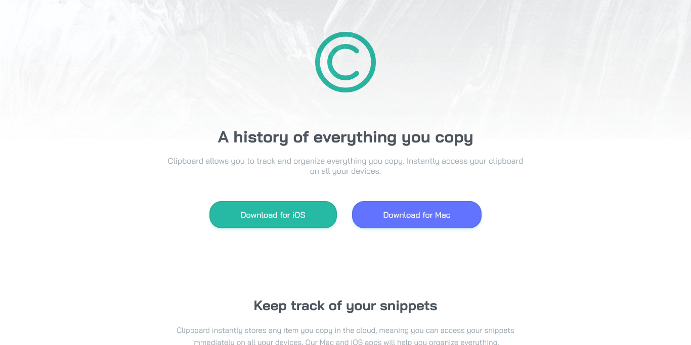

# Frontend Mentor - Clipboard landing page solution

Esta es una solución al desafío [Clipboard landing page challenge on Frontend Mentor](https://www.frontendmentor.io/challenges/clipboard-landing-page-5cc9bccd6c4c91111378ecb9). Los desafíos de Frontend Mentor te ayudan a mejorar tus habilidades de codificación mediante la construcción de proyectos realistas. 

## Table of contents

- [Descripcion](#descripcion)
  - [El desafio](#el-desafio)
  - [Captura de pantalla](#captura-de-pantalla)
  - [Enlaces](#enlaces)
- [Mi proceso](#mi-proceso)
  - [Tecnologias utilizadas](#tecnologias-utilizandas)
  - [Lo que aprendi](#lo-que-aprendi)
  - [Desarrollo continuo](#desarrollo-continuo)
  - [Recursos utiles](#recursos-utiles)
- [Autor](#autor)
- [Reconocimientos](#reconocimientos)

## Descripcion

### El desafio

Los usuarios deberían poder:

- Ver el diseño óptimo para el sitio según el tamaño de la pantalla de su dispositivo
- Ver los estados de desplazamiento para todos los elementos interactivos en la página

### Captura de pantalla

### Enlaces

- URL de la solución [GitHub](https://github.com/ReyCrisGit/Clipboard-landing-page)
- URL del sitio en vivo: [GitHubPages](https://reycrisgit.github.io/Clipboard-landing-page/)

## Mi proceso

### Tecnologias utilizadas

- Marcado semático HTML5
- CSS custom properties
- Flexbox
- CSS Grid
- Mobile-first workflow

### Lo que aprendi

Aprendí CSS Grid

### Desarrollo continuo

Dominio de Flexbox, Practicando CSS Grid, también el uso correcto de identificadores personalizados como id y class, y Mobile-first.

### Recursos utiles

- Los videos de [Jordan Alexander](https://www.youtube.com/@AlexCGDesign)
- Los videos de [Midudev](https://www.youtube.com/c/midudev)

## Autor

Sitio web - [Cristian Barrios](https://github.com/ReyCrisGit)
Frontend Mentor - [Cristian Barrios](https://www.frontendmentor.io/profile/ReyCrisGit)

## Reconocimientos

Al Instructor Jordan Alexander y MiduDev
